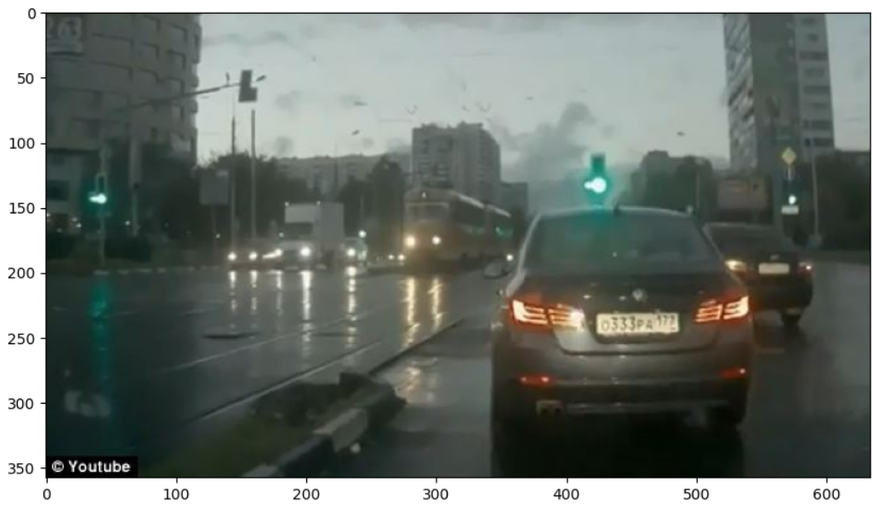
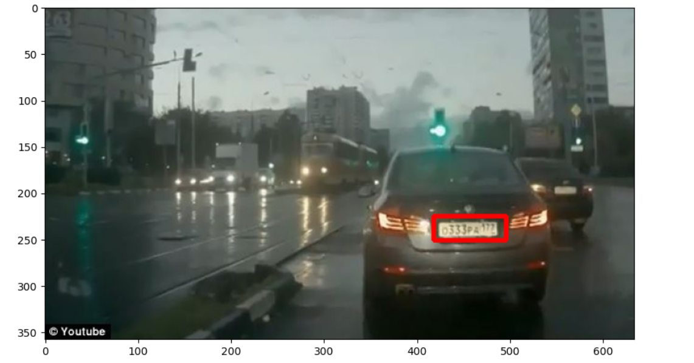
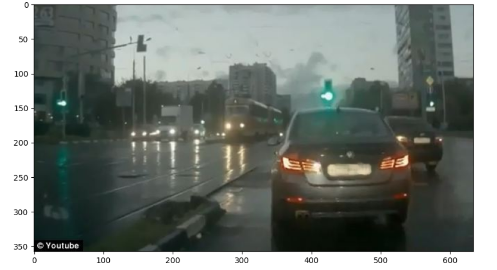

# WORKSHOP---5-License-Plate-Detection-using-OpenCV-and-Haar-Cascade-Classifier
## Aim

To detect the license plate from a vehicle image using the Haar Cascade Classifier in OpenCV and highlight or blur the detected number plate region.

---

## Software Required

* Python
* OpenCV Library
* NumPy
* Matplotlib
* Jupyter Notebook / Google Colab

---

## Algorithm

1. Import the required libraries such as OpenCV, NumPy, and Matplotlib.
2. Read the input vehicle image using OpenCV.
3. Display the image in proper RGB format.
4. Load the Haar Cascade XML classifier for license plate detection.
5. Create a function to detect the license plate region using `detectMultiScale()`.
6. Draw a rectangle around the detected license plate.
7. Modify the detected region by applying blur to hide the plate details.
8. Display the final output image with the detected or blurred license plate.

---

## Program:

```py
import numpy as np
import cv2 
import matplotlib.pyplot as plt
%matplotlib inline

img = cv2.imread('car_plate.jpg')

def display(img):
    fig = plt.figure(figsize=(10, 8))
    ax = fig.add_subplot(111)
    new_img = cv2.cvtColor(img, cv2.COLOR_BGR2RGB)
    ax.imshow(new_img)
    plt.show()

display(img)

plate_cascade = cv2.CascadeClassifier(cv2.data.haarcascades + 'haarcascade_russian_plate_number.xml')

def detect_plate(img):
    plate_img = img.copy()
    plate_rects = plate_cascade.detectMultiScale(plate_img, scaleFactor=1.3, minNeighbors=3)
    for (x, y, w, h) in plate_rects:
        cv2.rectangle(plate_img, (x, y), (x + w, y + h), (0, 0, 255), 4)
    return plate_img

result = detect_plate(img)

plt.figure(figsize=(10, 8))
plt.imshow(cv2.cvtColor(result, cv2.COLOR_BGR2RGB))
plt.show()

def detect_and_blur_plate(img):
    plate_img = img.copy()
    roi = img.copy()
    plate_rects = plate_cascade.detectMultiScale(plate_img, scaleFactor=1.3, minNeighbors=3)
    
    for (x, y, w, h) in plate_rects:
        roi = roi[y:y+h, x:x+w]
        
        blur = cv2.medianBlur(roi,7)
        
        plate_img[y:y+h, x:x+w] = blur
    
    return plate_img


result = detect_and_blur_plate(img)

display(result)


```

## Output:







## Result

The license plate in the vehicle image was successfully detected using the Haar Cascade Classifier in OpenCV. The detected plate region was highlighted and blurred effectively, demonstrating successful license plate detection and image processing.
